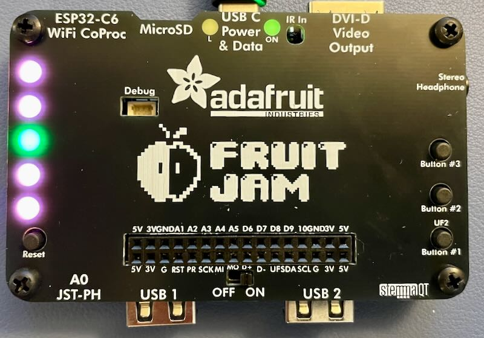
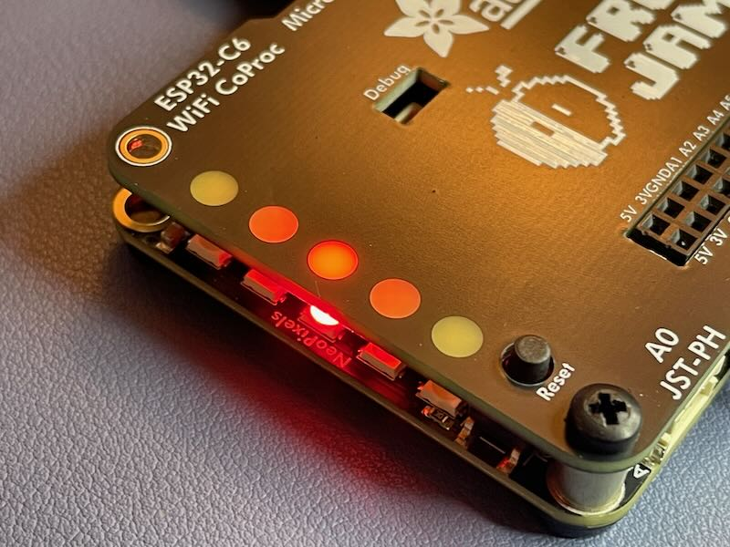
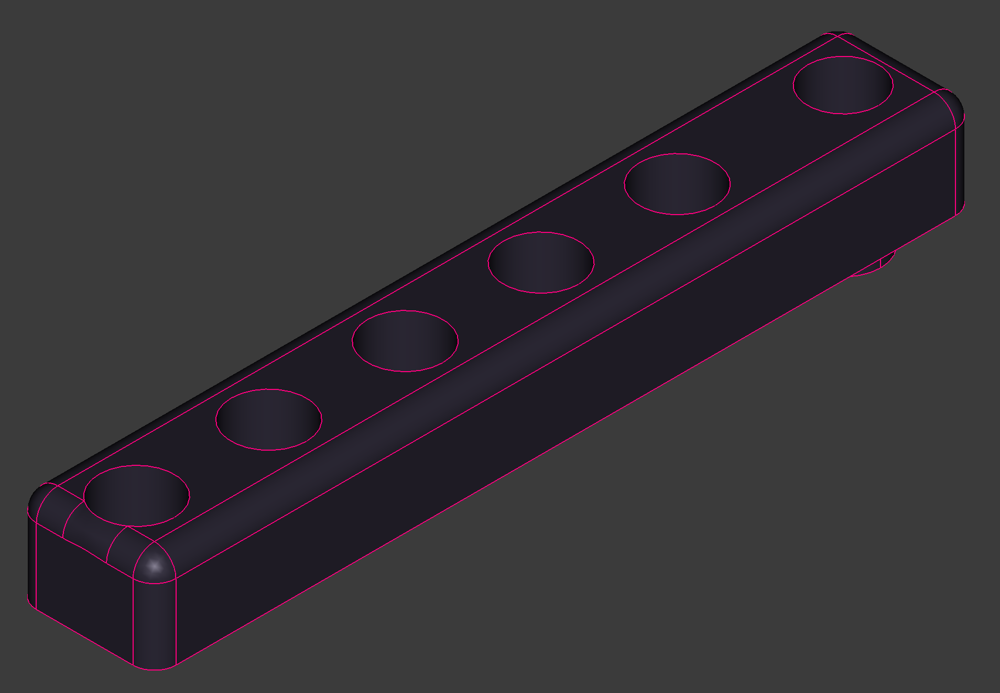
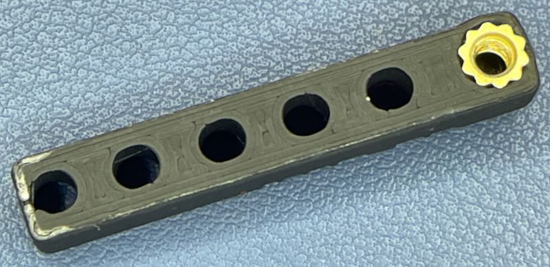
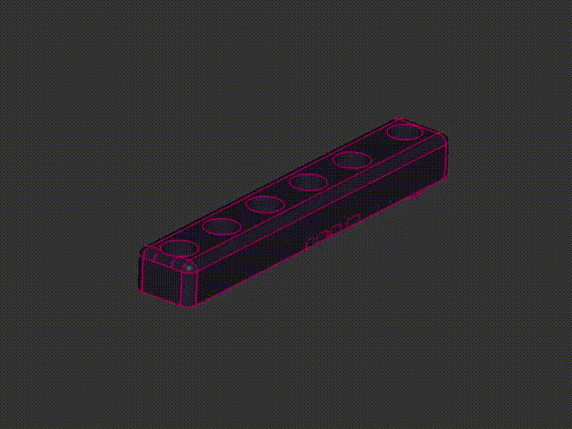

# Fruit Jam Light Tunnel

[@b-blake](https://github.com/b-blake) or [@blakebr](https://forums.adafruit.com/memberlist.php?mode=viewprofile&u=48200) noticed that the [Adafruit Fruit Jam](https://www.adafruit.com/product/5900) had a bit of light bleed between the built-in LEDs that shows through the default cover plate. We came up with a simple 3D print project to isolate the light from each LED into its own channel.

The 3 mm heat-set insert and fourth corner screw are optional, but help secure the cover plate.

Printed adapter installed — LEDs look much cleaner now!

### With Adapter

### Without Adapter

### Design Model

### Print Views
| Top View | Bottom View |
|-----------|--------------|
|  |  |

### Design Preview

### Hardware Used
| Item | Description | Link |
|------|--------------|------|
| 🔩 M3 Screws | 100 PCS M3 × 6 mm Round Head Nylon Machine Screws (Phillips Drive) | [Amazon](https://amzn.to/3L1oUj2) |
| 🟡 M3 Heat Inserts | 300 PCS M3 × D5 × L4 Brass Threaded Heat-Set Inserts for 3D Printing | [Amazon](https://amzn.to/3WjLF44) |
