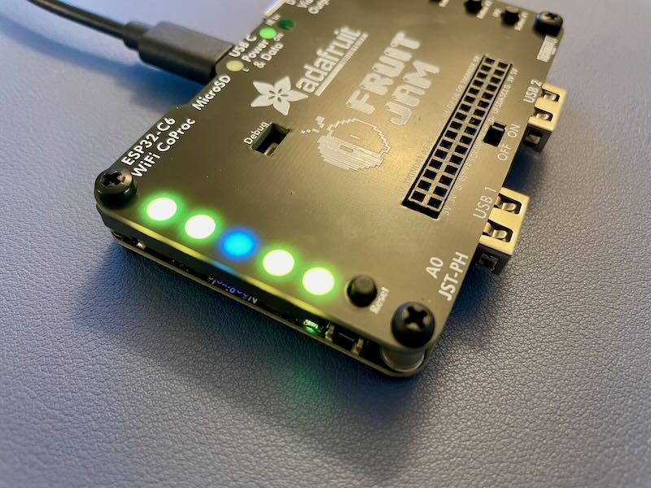

# fj-tunnel
Fruit Jam Light Tunnel

[@b-blake](https://github.com/b-blake) noticed that the [Adafruit Fruit Jam](https://www.adafruit.com/product/5900) had a bit of light bleed between the built-in LEDs and the default cover plate.  
I mocked up and printed a small 3D adapter to isolate the light from each LED to its own channel.  
The 3 mm heat-set insert and screw are optional, but help secure the fourth corner nicely.

Printed adapter installed — LEDs look much cleaner now!

### Without Adapter

### With Adapter

### Design Model

### Hardware Used

| Item | Description | Link |
|------|--------------|------|
| 🔩 M3 Screws | 100 PCS M3 × 6 mm Round Head Nylon Machine Screws (Phillips Drive) | [Amazon](https://amzn.to/3L1oUj2) |
| 🟡 M3 Heat Inserts | 300 PCS M3 × D5 × L4 Brass Threaded Heat-Set Inserts for 3D Printing | [Amazon](https://amzn.to/3WjLF44) |
